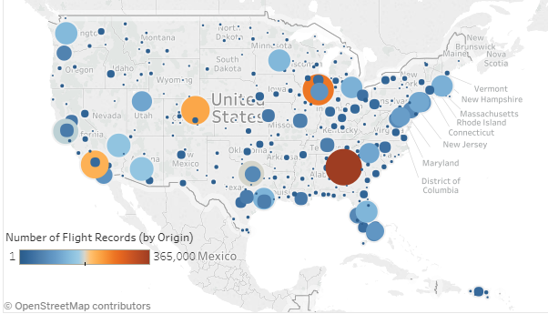

# US Flight Data 2017 Visualization

### Summary
The purpose of this project is to create data visualizations about United States flight data during 2017 using Tableau. The main areas of focus are related to airport traffic, flight delays, and reasons for cancellation by location, carrier, and time of year. The data set for this project was downloaded directly from the United States Department of Transportation (DOT), Bureau of Transportation Statistics [website](https://www.transtats.bts.gov/DL_SelectFields.asp?Table_ID=) and is also included in the [github repo](https://github.com/daniel-codes/us-flight-data-2017). More than 5.6 million flight records are used for this project.   

Data visualization available at:     
https://public.tableau.com/profile/daniel.cummings#!/vizhome/US_Flight_Data_2017/FlightDataStory

### Files

project_notes.ipynb - Detailed summary and notes of the design process     
US_Flight_Data_2017.twb - Tableau file    
zip_to_csv.py - Python script to convert zip files into csv file   
flight-data-Q1Q2-2017.zip - Flight data for Jan-June 2017   
flight-data-Q1Q2-2017.zip - Flight data for July-December 2017   

